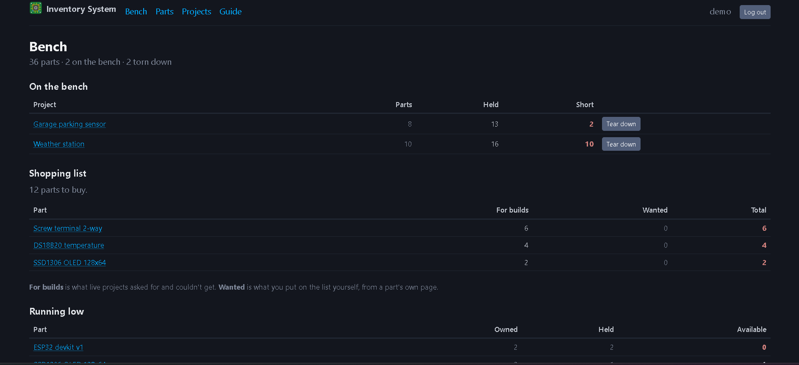

# inventory system

an electronics parts inventory that tracks how many of each component you own,
how many are currently allocated to projects, and how many are actually
available to use.



## try it

**[web-production-d6073.up.railway.app](https://web-production-d6073.up.railway.app)**

there's a demo account with 36 parts and 4 projects already in it:

```
username: demo
password: stardancedemo
```

everything in that account is made up. sign up for your own if you want to keep
anything.

## the idea

every other inventory tool assumes stock leaves and never comes back, because
they were all built for warehouses. that's not a hobby bench.

you build something, it holds your parts for three weeks, you tear it down, and
most of them come back. minus the ones soldered into the board. minus the ones
you let the smoke out of.

so parts here don't get used up, they get **held**:

```
owned      everything you have, loose in the bin or inside a live project
held       sitting inside a project right now
available  owned minus held, the number you actually care about
```

## features

- **teardown**: when a build is done, say what happened to every part. returned,
  soldered in, or broken. only the last two leave your inventory
- **reopen**: teardown is reversible. two clicks puts the project back on
  the bench with every quantity exactly where it was
- **shopping list**: what your live builds asked for and couldn't get, plus
  anything you flagged yourself, totalled per part
- **history**: every change to a quantity is logged with the balance it produced
  and the project responsible. "that number looks wrong" has an answer
- **duplicates**: `10k`, `10 K` and `10kΩ` are one resistor to a human and three
  rows to a database. it spots them and merges them
- **paste import**: get a whole bin in at once, one part per line
- **tags**: click to filter, autocomplete so typos don't split a group, rename
  across every part at once

## running it locally

python 3.13, no system dependencies, sqlite by default.

```bash
python -m venv venv
venv\Scripts\Activate.ps1        # or: source venv/bin/activate
pip install -r requirements.txt
```

make a `.env` next to `manage.py`:

```
SECRET_KEY=anything-for-local-use
DEBUG=True
```

then:

```bash
python manage.py migrate
python manage.py seed_demo --user me --password something
python manage.py runserver
```

## how it works

**one stored number, two derived.** `qty_owned` is the only quantity in the
database. `held` and `available` are computed, so they can't drift out of sync
with it. the parts list gets both from one annotated query rather than one per
row.

**nothing may move that number except one method.** `Part.adjust_stock()` takes
a row lock, writes the change, and writes the history line in the same
transaction. `check_stock` reconciles the two on demand, because a guarantee you
can't verify is a hope. writing the tests for it found a real hole: creating a
part directly skipped the ledger, which the views happened to cover.

**allocation doesn't refuse you.** it used to, which meant a project could never
actually be short, which meant there was nothing to build a shopping list out
of. now it takes what exists and records the rest as short, because running out
is information rather than an error.

**teardown is one transaction.** it writes the outcome per line, decrements
`qty_owned` by whatever was soldered or broken, and archives the project. a
teardown that fails validation changes nothing at all.

some rules live in the database rather than the forms, so they hold even if a
view is wrong later: one line per part per project, allocated can never exceed
wanted, accounted can never exceed allocated.

208 tests, mostly on the arithmetic.

## stack

django 6.1, postgres in production and sqlite locally, whitenoise, gunicorn,
[pico.css](https://picocss.com). deployed on railway. no javascript.

## credits

- [pico.css](https://picocss.com) for the styling, which is why this has a
  design without one being written
- [dj-database-url](https://github.com/jazzband/dj-database-url) and
  [whitenoise](https://whitenoise.readthedocs.io) for making deployment boring
- django, for the auth and admin that didn't have to be built
